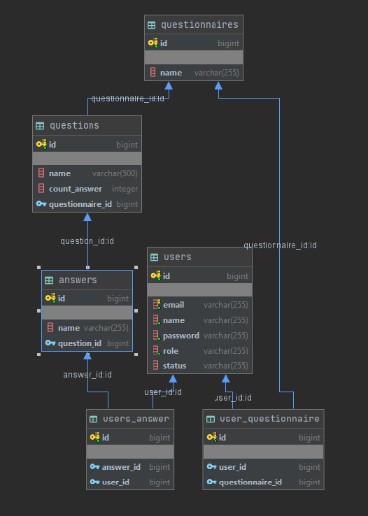
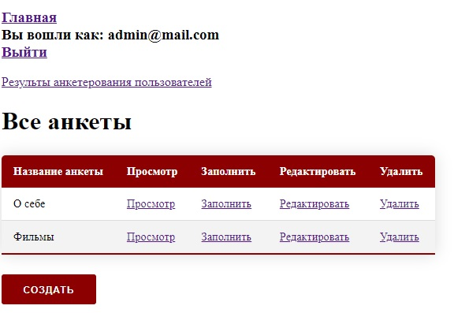

# Мини анкетная система

Приложение реализующее возможность добавления, редактирования и удаления анкет, а также вопросов к ним,
с возможностью заполнить и сохранить данные ответы на вопросы.

### Используемые технологии
Spring Boot, Spring MVC, Spring Data, Spring Security, Spring Validation, 
H2, Maven, JUnit, Mockito, MapStruct, Slf4j, Thymeleaf.

## Обзор приложения
### Авторизация
| Логин | Пароль | Роль |  
| ------ | --- | ---------- 
| admin@mail.com   | admin | ADMIN
| ivan@mail.com   | ivan| USER 
________________________________________________________________________________

### Схема базы данных

### Интерфейс

